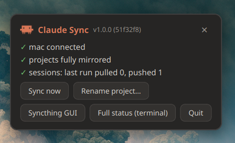
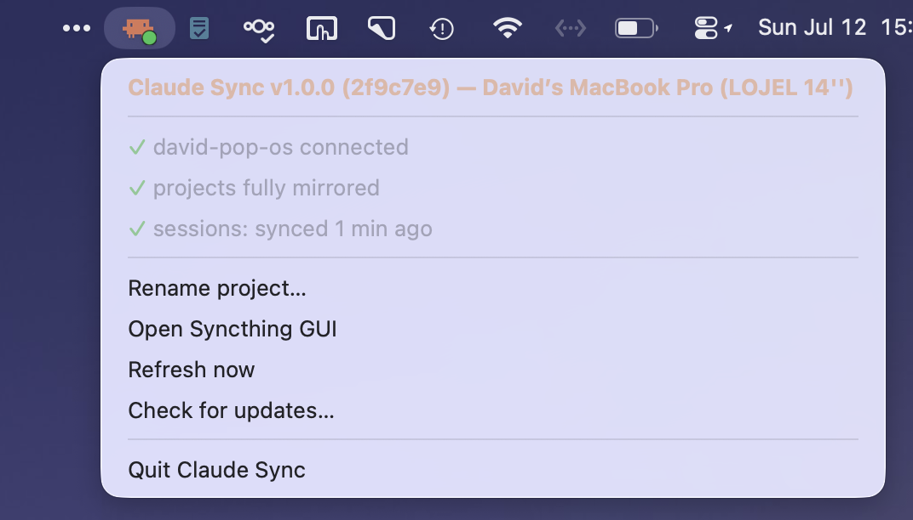

# claude-sync

**Resume any Claude Code session on any machine.** Cross-device sync of Claude Code sessions, per-project memory, skills, and project files across Linux and macOS machines — everything over Syncthing, ideally relayed by an always-on device (a NAS), with a native status indicator on every desktop.

> Not affiliated with Anthropic; the Claude Code mark is fetched at install time from [LobeHub icons](https://lobehub.com/icons/claudecode), not committed here. Nothing is hardcoded — a setup wizard generates a config per machine (`~/.config/claude-sync/config`) with your paths, peers and device IDs.

<p align="center">
  
  &nbsp;&nbsp;
  
</p>

## The problem

Claude Code stores each conversation under `~/.claude/projects/<encoded-path>/`, where the directory name and the `cwd` fields inside the transcript are derived from the project's **absolute path**. `/home/you/Claude/foo` and `/Users/you/Claude/foo` are different worlds — sessions written on one machine are invisible to `claude --resume` on the other, and there is no built-in sync for local CLI sessions.

## How it works

Everything travels over Syncthing; no machine ever needs another one awake. An always-on device (a NAS works perfectly) relays and keeps a third copy:

```
   Linux                      always-on NAS                    macOS
┌──────────────┐           ┌───────────────────┐           ┌──────────────┐
│ live session │ translate │  sessions/ (raw   │ translate │ live session │
│ store        │◄─────────►│  canonical store) │◄─────────►│ store        │
│              │  (local)  │                   │  (local)  │              │
│ ~/Claude ────┼─Syncthing─┤  projects/        ├─Syncthing─┼── ~/Claude   │
└──────────────┘           └───────────────────┘           └──────────────┘
```

- **Sessions, memory, skills** — Claude Code keys session stores to absolute paths, so they can't be mirrored raw. Each device runs `claude-session-translate` every 2 minutes (systemd timer / launchd agent): a **local** two-way merge between the live store and `~/.claude/sync-staging`, a canonical form where machine paths become `__CLAUDE_ROOT__` / `__CLAUDE_HOME__` placeholders. Syncthing mirrors the staging folder across all devices; the relay just stores it (no claude-sync code on the NAS). Newest-wins per file, mtimes preserved (idempotent), **never deletes**, memory synced regardless of age. Projects roots can differ per machine — canonical form is machine-agnostic. Staging also carries `_user/` (skills, agents, commands, no translation needed) and `_control/` (per-host heartbeats and the rename queue).
- **Project files** — plain Syncthing mirror of the projects root with build-junk ignores (`.stignore`) and a 30-day trash can for deletions.
- **v2 note** — the previous SSH-based engine (`claude-session-sync`) still ships for reference but is no longer wired to the timer.

## Status indicators

Health badge colors on both platforms: **green** = all delivered · **blue** = a peer is offline but nothing is queued for it · **amber** = data queued or transferring, or an update is pending · **red** = a local service is down.

- **Linux**: a PyQt6 tray icon (`claude-sync-tray`). Left-click opens a popup card (installed version in the header, ✕ or click-outside to close): per-device translate heartbeats, mirror completion, orphaned-store detection with one-click repair, and every action — *Update now* (when applicable), *Sync now*, *Rename project…*, *Syncthing GUI*, *Full status (terminal)*, *Quit*. Survives panel restarts (StatusNotifierWatcher gating). `claude-sync-status` gives the same report in a terminal.
- **Mac**: a native compiled menu-bar app (**Claude Sync.app**, `mac/menubar/`, built by the installer when Xcode CLT is present; a SwiftBar plugin ships as fallback). Same status lines and actions, version in the header, *Check for updates…* on demand.
- **Updates**: both indicators check automatically (30-minute cadence, kept warm by the translator even on headless boxes), notify once when a new version appears, and apply it with one click.

## Renaming projects safely

Because sessions are keyed to absolute paths, renaming a project folder orphans its history. This repo handles that three ways:

1. **Proactive** — *Rename project…* in either indicator (Qt dialog on Linux, native dialogs on macOS). Renames the folder, migrates the local session store, and queues the migration for **every other device** through the synced `_control` channel — their translators apply it within minutes, awake or not.
2. **Reactive** — both indicators detect orphaned session stores (a store whose folder no longer exists), fuzzy-match against existing folders, and offer a one-click **Repair** (also covers renames done in Finder / the Files app).
3. **Manual** — `claude-mv-project OLD NEW`, with `--store-only` for a local-only store migration, and `CMP_BASE` for moves from outside the projects root.

Migrations preserve mtimes, disambiguate Claude's lossy path encoding by reading the real `cwd` from transcripts, and merge instead of clobbering when the target store already exists.

## Install

Since v3 every device syncs symmetrically (each runs its own translator on a 2-minute timer). Setup is driven from a Linux machine:

```bash
./install-linux.sh     # from a clone (needs python3-pyqt6) — or: sudo apt install ./claude-sync_*.deb from the releases page
claude-sync-setup      # interactive wizard — connects a device end to end
```

The wizard asks two things — where your projects live, and the peer's address — and does the rest:

- generates an SSH key and authorizes it on the peer (`ssh-copy-id`)
- detects the peer's OS, home directory and projects folder
- **installs Syncthing wherever it's missing, skips it where present** — static binary + systemd unit on Linux, Homebrew cask or official DMG on macOS
- pairs the two Syncthing instances and shares **both folders** (projects + session staging) via the REST API on both ends — no clicking through web GUIs
- deploys the peer-side tools and the translate timer/agent, and starts syncing

**More devices**: run `claude-sync-setup` again per device; existing devices are automatically included in every new share, so the mesh stays complete. Every step is check-first — rerunning is always safe.

**Always-on relay** (recommended): `claude-sync-setup relay` adds any always-on Syncthing device — a NAS, a Pi, a server. It needs **zero claude-sync code and no SSH**: paste its Syncthing device ID (plus optionally its GUI URL + API key for hands-off configuration, otherwise you accept the two folder offers in its GUI once). With a relay in the mesh, no two machines ever need to be awake together.

Device prereqs: SSH reachable once for deployment (macOS: System Settings → Sharing → Remote Login; Linux: sshd) — after setup, SSH is not used for syncing. Relays need no SSH at all.

`install-mac.sh` can also be run directly on a Mac from a clone, or use the `.dmg` from the releases page (app + one-click CLI installer).

## Configuration

Everything lives in `~/.config/claude-sync/config` (shell syntax, generated by the wizard, editable by hand):

```bash
LOCAL_ROOT="/home/you/Claude"               # where your projects live on THIS machine
LOCAL_HOME="/home/you"
ST_FOLDER_ID="claude-projects"              # syncthing folder: project files
ST_SESSIONS_FOLDER_ID="claude-sessions"     # syncthing folder: canonical session staging
MAX_AGE_DAYS=45                             # sessions older than this stay put
PEERS="mac"                                 # used by the wizard & indicators
PEER_DEVICE_mac="ABCDEFG-…"                 # per-peer syncthing ids for completion display
```

Roots may differ per machine — the canonical staging form is machine-agnostic.

## Layout

| Path | What |
|---|---|
| `linux/claude-session-translate` | the sync engine: live store ↔ canonical staging (runs on every device) |
| `linux/claude-sync-tray` | PyQt6 tray + popup + rename dialog + icon renderer |
| `linux/claude-sync-status` | terminal status report |
| `linux/claude-sync-setup` | interactive device-pairing wizard |
| `linux/claude-sync-check-update` | update checker/applier (shared with macOS) |
| `linux/claude-mv-project` | rename/move migration tool (shared with macOS) |
| `linux/claude-session-sync` | legacy v2 SSH engine (unwired, kept for reference) |
| `linux/systemd/`, `linux/desktop/` | timer, services, launcher, autostart |
| `mac/menubar/` | native menu-bar app (Swift source + build script) |
| `mac/claude-rename-project` | native-dialog proactive rename |
| `mac/claude-sync-translate.plist` | translate LaunchAgent template |
| `mac/claude-sync.60s.sh`, `mac/swiftbar.plist` | SwiftBar fallback (no Xcode CLT) |
| `packaging/` | `.deb` and `.dmg` release builders |
| `VERSION` | release version, shown in both indicators |

## Caveats (learned the hard way)

- **Don't run Claude Code on the same project on both machines at the same moment** — transcripts are append-only JSONL; newest-wins would drop one side's tail.
- Keep Claude Code versions matched; the session format is internal and changes between releases.
- With an always-on relay device in the Syncthing mesh, nothing needs to be awake together — data queues on the relay. Without one, two machines sync only when both are up.
- Path rewrites must **preserve mtimes** (`sed -i` bumps them, which makes stale copies look fresh to a newest-wins sync and fans them out — this bug bit once).
- A rename can be resurrected by the other machine touching old-path files in the propagation window (git index refreshes are enough). The tools poke an immediate Syncthing rescan to narrow it; if a zombie folder appears, the orphan detection will flag it.

## License

MIT
